

# YTS Terminal Manager

### One terminal to rule them all

**SSH · Telnet · Serial · SFTP · FTP · SCP · RDP · PowerShell · CMD**

Every remote session in one streamlined Windows app — with a built-in AI assistant,
a Python automation API and an embedded server stack.
Replaces PuTTY, WinSCP — and half your toolbox.

 

 

---

## What it is

**YTS Terminal Manager** is an all-in-one terminal management application for Windows, built for
network engineers, system administrators, developers and power users.

The console cable, the jump host, the firewall's web UI and the file transfer all live in the same
window — sharing the same favourites, the same logging and the same shortcuts. The services you
normally scramble to install mid-job (TFTP, SYSLOG, TACACS+) are already there, one click from the
session that needs them.

> Downloads, release notes and system requirements live on the product page:
> **https://yts-hub.com/terminal-manager/**

---

## Highlights

|  | |
|---|---|
| 🤖 **An AI that speaks CLI** | Reads your live terminal, understands the device you're on, and acts only with your permission. Cloud or 100% local. |
| 🪟 **Multi-screen** | Drag any tab out of the main window into a real standalone window — the session never drops. |
| ▦ **Multi-view layout** | Single, horizontal, vertical and matrix. Switch any time; nothing disconnects. |
| 🗄 **Six embedded servers** | SFTP, FTP, TFTP, TACACS+, SYSLOG and a Terminal Server — no separate install. |
| 🐍 **Python automation** | A real interpreter wired to your live sessions, with an editor, console and on-connect scripts. |
| 🧰 **Diagnostics built in** | Port scanner, SNMP walk, ping latency graph, traceroute, Wake-on-LAN, subnet calculator. |
| 🔒 **Safe by default** | SSH host keys pinned on first use; credentials encrypted at rest with Windows DPAPI. |

---

## The AI assistant

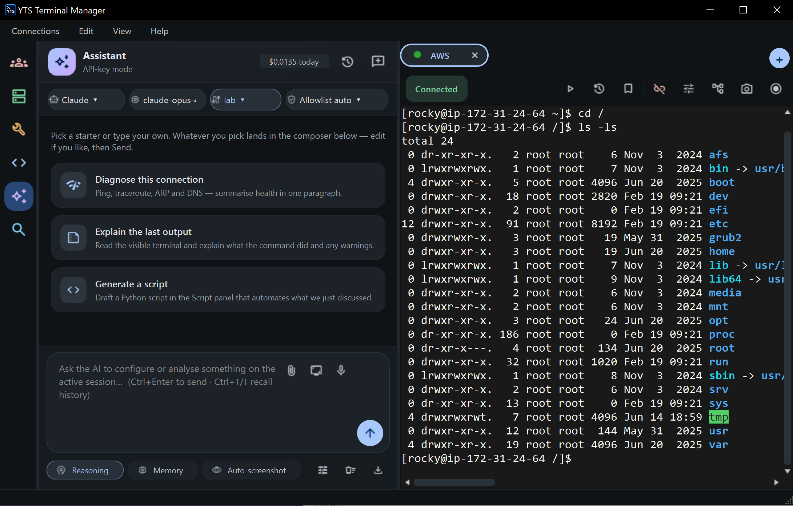

Paste nothing. Switch nowhere.

* **Diagnose** — *"Why is this BGP neighbor down?"* It reads the session output and tells you, with
  the exact `show` commands it ran.
* **Explain** — highlight any wall of output and get a plain-English explanation in seconds.
* **Generate & configure** — describe the change; it plans the commands, shows a preview, and a
  safety risk-gate asks before anything mutating runs.
* **Private if you want** — run it against a local model (Ollama, LM Studio, vLLM); nothing leaves
  your machine.

Works with Anthropic Claude, OpenAI, Google Gemini, Qwen, GLM and GitHub Models. Bring your own API
key — a free Gemini key works out of the box, and the assistant is entirely optional.

---

## Clients — every protocol, one window

<table>
<tr>
<td width="50%">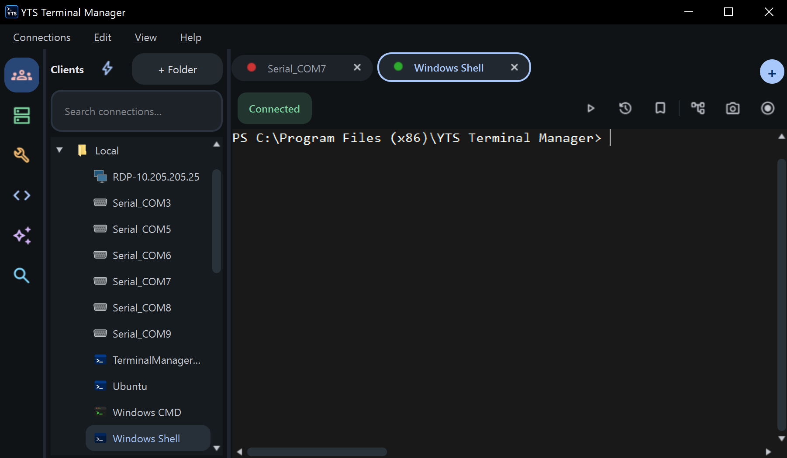</td>
<td width="50%">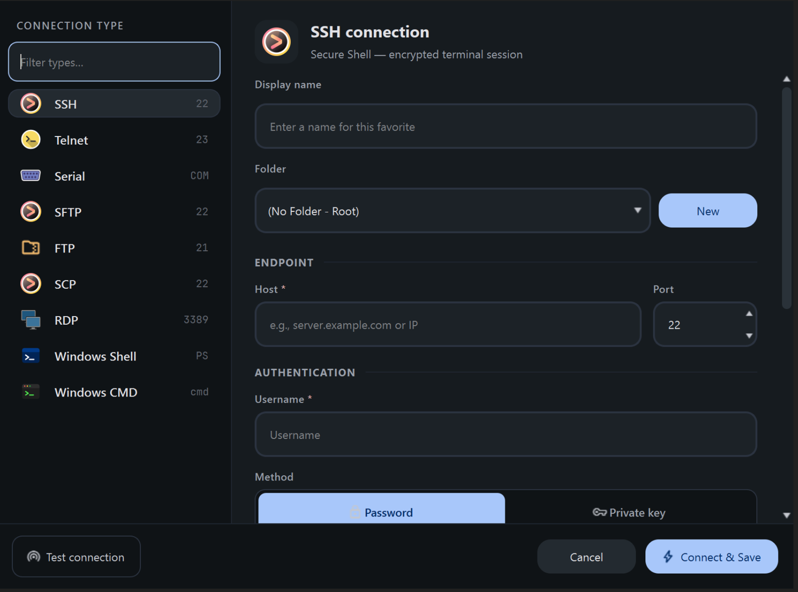</td>
</tr>
<tr>
<td align="center"><b>Favourites that scale</b> · folders, search, drag-and-drop</td>
<td align="center"><b>Ten connection types</b> · one dialog</td>
</tr>
</table>

| Group | Protocols | |
|---|---|---|
| **Remote shells** | `SSH` `Telnet` `Serial` | Routers, switches, firewalls and embedded gear — over the network or straight down an RS-232 / RS-485 console cable. |
| **File transfer** | `SFTP` `FTP` `SCP` | Drag files onto a session to upload, or browse the remote tree in a sidecar panel that follows your shell's directory. |
| **Desktop & web** | `RDP` `Web` | Remote desktops and device management UIs open as ordinary tabs. |
| **Local shells** | `PowerShell` `CMD` | Full ConPTY terminals that run modern TUIs properly. |

**Quick-Connect** (`Ctrl+Shift+Q`) for one-line access, saved favourites for the fleet, or auto-start
so critical sessions are open before you sit down.

---

## Embedded servers — six services, already installed

<table>
<tr>
<td width="50%">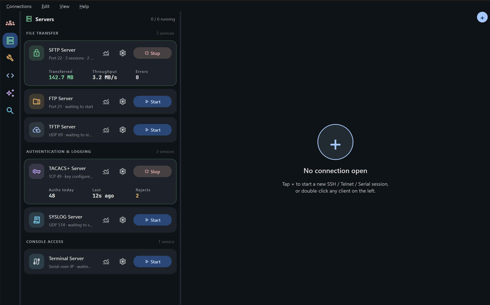</td>
<td width="50%">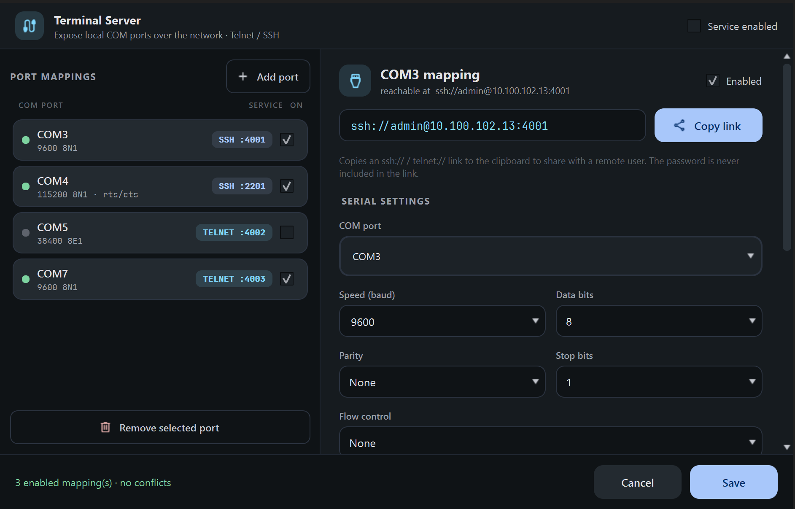</td>
</tr>
<tr>
<td align="center"><b>The stack</b> · six services, started with one click</td>
<td align="center"><b>Terminal server</b> · local COM ports, reachable over SSH or Telnet</td>
</tr>
</table>

| Group | Services | |
|---|---|---|
| **File transfer** | `SFTP · 22` `FTP · 21` `TFTP · UDP 69` | Serve a config backup or firmware image in seconds. Replaces tftpd64 and FileZilla Server. |
| **Auth & logging** | `TACACS+ · TCP 49` `SYSLOG · UDP 514` | Test AAA against a real TACACS+ server; catch a device's syslog the moment it misbehaves. |
| **Console access** | `Terminal Server` `Serial-over-IP` | Share local COM ports over SSH or Telnet — a console server in software. No hardware to buy. |

Every server has a structured, filterable live log viewer — not a text file.

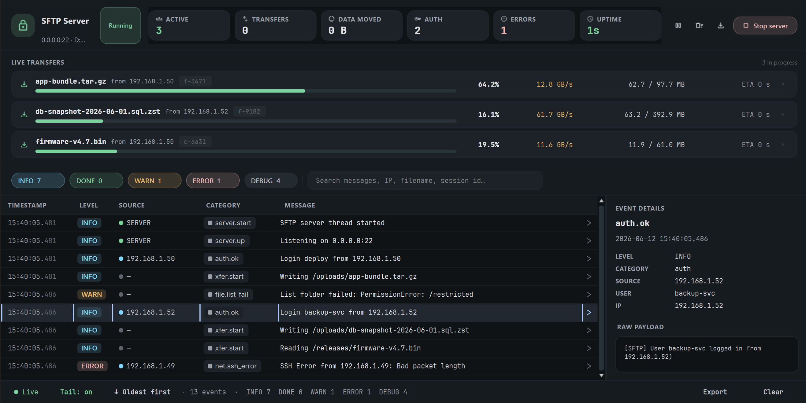

---

## Multi-view layout

One window, four ways to look at it. Focus on one device, split the window into panes, or tile the
whole fleet and watch every session react at once.

<table>
<tr>
<td width="50%">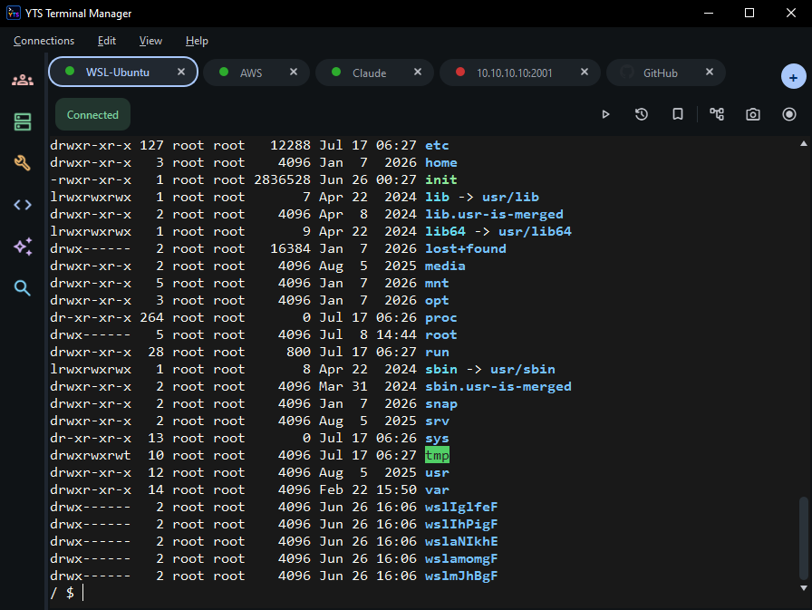</td>
<td width="50%">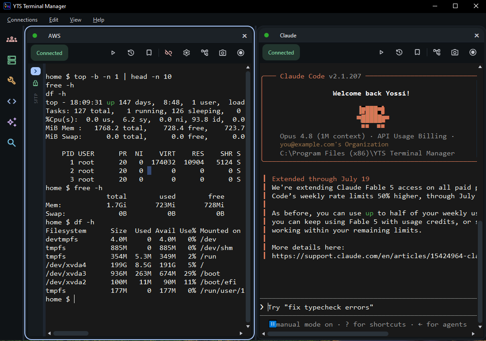</td>
</tr>
<tr>
<td align="center"><b>Single</b> · one session, full window</td>
<td align="center"><b>Horizontal</b> · two sessions side by side</td>
</tr>
<tr>
<td width="50%">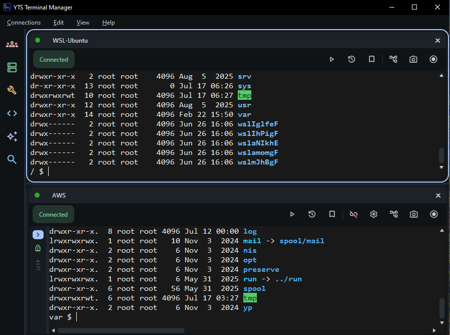</td>
<td width="50%">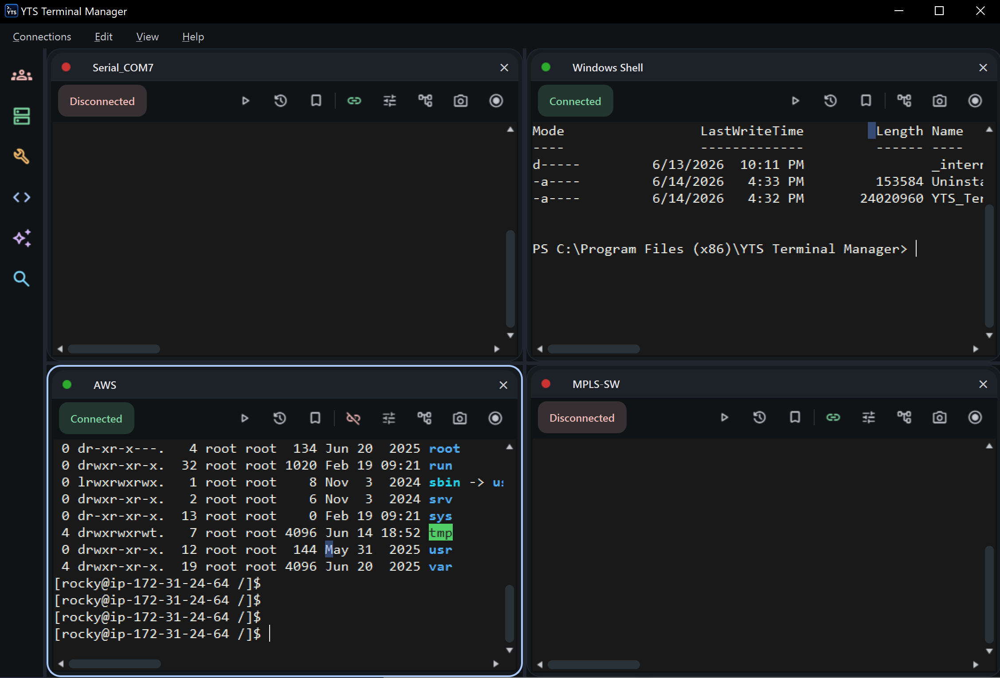</td>
</tr>
<tr>
<td align="center"><b>Vertical</b> · stacked — ideal for wide, long output</td>
<td align="center"><b>Matrix</b> · the whole fleet at a glance</td>
</tr>
</table>

Plus **multi-screen**: drag a tab out of the window entirely and drop it on your second monitor. It
becomes a real, independent window, the connection stays live, and dragging it back re-docks it.

---

## Tools — the diagnostics, built in

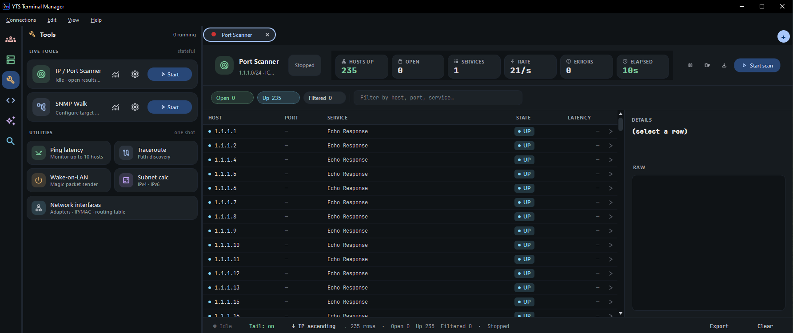

| | |
|---|---|
| **Live tools** | IP / Port Scanner (accurate open/filtered classification) · SNMP Walk — sortable, exportable report views |
| **Utilities** | Ping latency graph (up to 10 hosts on one timeline) · Traceroute · Wake-on-LAN · IPv4 / IPv6 subnet calculator |
| **Local inspection** | Network interfaces, IP/MAC addresses and the routing table — with a jump into Windows' adapter properties |

---

## Python automation

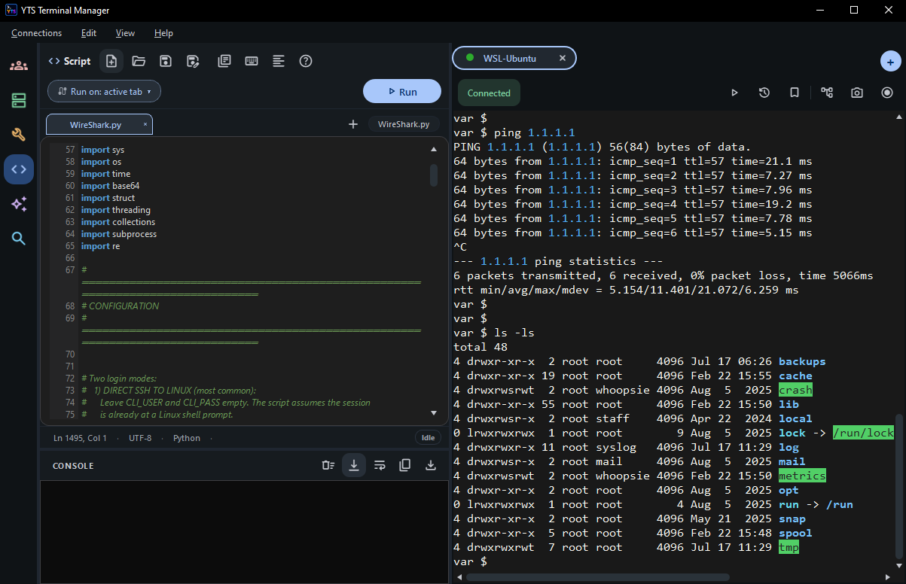

A real Python interpreter wired to your live sessions. Read the screen, send commands, drive SFTP,
even automate an embedded web page — scripted once, then run against one device or the whole fleet.

* **Run against the active tab** — output lands in the console beside the editor.
* **A real editor** — multiple script tabs, syntax highlighting, a snippet library and a formatter.
* **Terminals *and* web** — the same API navigates an embedded web tab, fills fields, clicks and runs
  JavaScript, for the device UIs that never got a CLI.
* **Fires on connect** — attach a script to a favourite and it runs the moment the session opens.

---

## Full feature list

<b>Remote access clients</b>

SSH · Telnet · Serial (RS-232 / RS-485) · SCP · SFTP · FTP · RDP integration · embedded web tabs

<b>Embedded servers</b>

SFTP server · FTP server · TFTP server · TACACS+ server · SYSLOG server · Terminal Server (serial-over-IP)

<b>Windows integration</b>

PowerShell integration · Windows CMD integration · full ConPTY terminals

<b>Productivity</b>

Multi-tab interface · multi-view layouts (single / horizontal / vertical / matrix) · detachable tabs
for multi-monitor · command broadcasting to device groups · search across connections · session
recording · automatic session logging · drag-and-drop SSH file transfers · Python scripting inside
the terminal

<b>Network tools</b>

IP / port scanner · ping latency monitor · traceroute · SNMP walk · Wake-on-LAN · IPv4 / IPv6 subnet
calculator · network interface & routing table inspection

<b>Terminal features</b>

VT100 emulation · large scrollback buffer · custom terminal themes · highlight rules ·
high-performance rendering engine · X11 forwarding support

<b>Security</b>

SSH host-key pinning on first use (TOFU) · credentials encrypted at rest with Windows DPAPI ·
AI risk-gate confirmation before any mutating command · no bundled software

---

## How it stacks up

| Capability | **YTS Terminal Manager** | PuTTY | WinSCP | MobaXterm Free |
|---|:---:|:---:|:---:|:---:|
| Tabbed multi-session + matrix view | ✅ | — | — | ✅ |
| Multi-screen — tear a tab into its own window | ✅ | No tabs | — | — |
| SSH / Telnet / Serial | ✅ | ✅ | SFTP only | ✅ |
| SFTP / FTP / SCP client | ✅ | — | ✅ | ✅ |
| Built-in AI assistant (cloud + local) | ✅ | — | — | — |
| Command broadcast to device groups | ✅ | — | — | Multi-exec only |
| Embedded FTP/SFTP/TFTP/TACACS+/SYSLOG servers | ✅ | — | — | Partial |
| COM-port console server (serial-over-IP) | ✅ | — | — | — |
| Python automation API | ✅ | — | .NET/COM | Macros |
| Port scanner, SNMP walk, subnet calc | ✅ | — | — | ✅ |
| Session limit | Unlimited | Unlimited | Unlimited | 12 sessions |

Comparison based on publicly documented free-tier features, July 2026. All product names are
trademarks of their respective owners.

---

## Download

### [⬇ Get YTS Terminal Manager — v2.02](https://yts-hub.com/terminal-manager/)

**https://yts-hub.com/terminal-manager/**

Installer, release notes and changelog are all on the product page.

| | |
|---|---|
| **OS** | Windows 10 / 11 (64-bit) |
| **RAM** | 4 GB minimum |
| **Disk space** | ~600 MB |
| **Install** | Standard installer — no additional runtimes |
| **Licence** | Currently free for personal and commercial use |

---

## FAQ

<b>Is it a good PuTTY alternative?</b>

It covers everything PuTTY does (SSH, Telnet, Serial) and adds tabbed multi-session views,
SFTP/FTP/SCP transfers, RDP, an AI assistant, Python automation, command broadcast and an embedded
server stack — features that would otherwise need PuTTY + WinSCP + several more tools.

<b>Which AI models does the assistant support?</b>

Anthropic Claude, OpenAI, Google Gemini, Qwen, GLM and GitHub Models — or a fully local model via
Ollama, LM Studio or vLLM for air-gapped environments. You bring your own API key; a free Gemini key
works out of the box, and the assistant is entirely optional.

<b>Can it act as a console server for serial devices?</b>

Yes. The Terminal Server feature bridges local COM ports to the network over Telnet or SSH, with
per-port authentication — a software console server, built in.

<b>Is my data safe?</b>

Favourites and credentials are encrypted at rest with a per-install key sealed by Windows DPAPI.
SSH host keys are pinned on first use (TOFU) to detect man-in-the-middle attacks, and the AI
risk-gate asks before any risky command runs.

<b>Is the source code here?</b>

No — this repository is the public home for documentation, screenshots and issue reports.
YTS Terminal Manager itself is a closed-source Windows application distributed from
[yts-hub.com](https://yts-hub.com/terminal-manager/).

---

## More from YTS-Hub

| | |
|---|---|
| 📡 **[ETH Packet Generator](https://yts-hub.com/packet-generator/)** | Craft raw Ethernet frames with full header control — Layer 2/3 testing for Windows. |
| 🔌 **[Serial Traffic Generator](https://yts-hub.com/serial-generator/)** | Stress-test RS-232/RS-485 links with patterns, error injection and a visual comparator. |

---

**[yts-hub.com](https://yts-hub.com/)** · *Master the Network*

Free professional network tools for Windows. Built by an engineer, for engineers.

Questions or bugs? [Open an issue](../../issues) or use the
[contact page](https://yts-hub.com/contact/).

